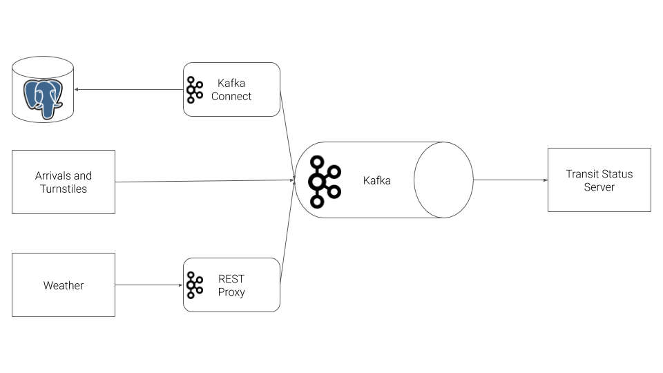

# Public Transit Status with Apache Kafka

This project implements a streaming event pipeline around Apache Kafka and its ecosystem. Using public data from the [Chicago Transit Authority](https://www.transitchicago.com/data/), 
the project constructs an event pipeline around Kafka that allows us to simulate and display the status of train lines in real time. The project allows users
to monitor a website to watch trains move from station to station.

## Project Overview

The Chicago Transit Authority (CTA) wants to develop a dashboard displaying system status for its commuters. To design and implement the project, we have use Kafka and ecosystem tools like REST Proxy and Kafka Connect to accomplish the task. And the architecture of the implementation is depicted below.

